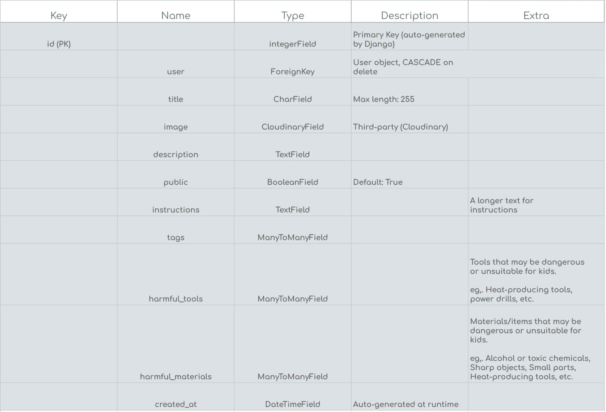

# Reoptinew API

**Navigate to the deployed API** [here](https://reoptinew-api-c16dc2520739.herokuapp.com/) 🔥

## Table of Contents

- 🎨 [Frontend](#frontend)
- 🛢️ [Databases](#databases)
- ❌ [Error handling](#error-handling)
- 🛠️ [Technologies](#technologies)
- 🖊️ [References](#references)

## Frontend

The Reoptinew web app uses a decoupled architecture, separating the frontend and backend repositories. The **frontend repository** can be found [**here**](https://github.com/KevinBjarnemark/reoptinew).

## Databases

> ⚠️ **NOTE**  
> If you need to access the production database locally, you can do so altough it is **strongly discouraged**. Fortunately, since environment variables are managed by Heroku, any accidental changes will be overwritten by Heroku's configuration during deployment. Always restore the `DEVELOPMENT_DATABASE` variable to its original value after making local changes to avoid unintended consequences.

Currently, there are three separate databases that Reoptinew relies on. One for testing, another for development, and another for production. 

- **Testing database**

    - Designed to be a "clean sheet" for running automated tests. It provides a temporary environment where all data exists in memory and is completely erased after the tests finish. This ensures no impact on development or production data during the testing process.

- **Development Database**

    - Intended for local development and debugging. It contains data specific to the development process and is configured to be easily replaceable if needed.

- **Production Database**

    - Stores real user data and operates in a secure, live environment.

### Models

You can find the complete data schema for all models in this [Google Drive folder](https://drive.google.com/drive/folders/1WrPCJ0CRQjOo84iZWGu7mcBEgYjKUaZA?usp=sharing). 

## Error Handling

Reoptinew’s error-handling system is built on three core principles: user experience, security, and troubleshooting.

### User Experience

The backend ensures that all errors sent to the frontend are clear, user-friendly, and meaningful. Error messages are mapped to custom messages that align with Reoptinew’s branding and interface standards. 

For additional UX details, visit the [**frontend repository**](https://github.com/KevinBjarnemark/reoptinew).

### Security

Reoptinew prioritizes security by implementing a **controlled error system** to eliminate risks associated with exposing raw backend data. 

Key benefits of this system include:

1. **Thorough Validation:**   
    Every piece of information sent to the client is inspected and sanitized.

2. **Backend Logic Protection:**  
    While Reoptinew's backend logic is open-source and fully transparent, the system ensures that runtime details, such as stack traces or low-level error messages, are not exposed to the frontend.

3. **Resilience Against Updates:**  
    Controlled error handling mitigates risks of application failures caused by changes in dependencies or library updates.

### Troubleshooting, Performance, and Logging

Printing to the console with `print()` in production is discouraged due to potential security and performance risks. Reoptinew instead relies on a custom logging system [logging.py](static/py/utils/logging.py) to ensure clarity, consistency, and controlled output.

- **Detailed Logs:**  
The [throw_error()](static/py/utils/error_handling.py) function captures all errors with contextual metadata, such as the file and function where the error occurred.

## Technologies

See [requirements.txt](requirements.txt) for the full third party packages list.

### Programming languages

    

        Python
    

**A popular language famous for its readability and efficiency in back-end development.** 

### Frameworks

    

        Django
    

**A web framework that simplifies the creation of secure and scalable web applications.**

    

        Django REST Framework (DRF):
    

**An extension of Django for building feature-rich, RESTful APIs.**

### Authentication

    

        PyJWT
    

**A Python library for JSON Web Tokens (JWT).**

PyJWT is a library for encoding and decoding JSON Web Tokens. It supports token signing and validation using various algorithms.

### Cloud services

    

        Cloudinary
    

**A cloud-based service for managing, storing, and delivering media assets like images and videos.**

### Testing

    

        Pytest
    

**A testing framework for Python applications.**

Pytest is a framework used for writing and running tests in Python. It supports features like fixtures, parameterized tests.

### Environment Management

    

        python-decouple
    

**A lightweight library for separating configuration settings from source code, improving maintainability and security.**

### Additional libraries

    

        dj-database-url
    

**A utility to configure database connections using a single database URL, simplifying the transition between development, testing, and production environments.**

    

        psycopg2-binary
    

**A PostgreSQL adapter for Python, enabling seamless integration with PostgreSQL databases.**

    

        pillow
    

**A library for image processing in Python, supporting tasks like image resizing, format conversion, and filtering.**

    

        django-cors-headers
    

**A middleware for handling Cross-Origin Resource Sharing (CORS) in Django, ensuring secure communication between the front-end and back-end.**

    

        django-cloudinary-storage
    

**A package for integrating Cloudinary with Django, providing a way to manage media files in the cloud.**

## References

It's worth mentioning **source code references**. These references can be found in the project itself, particularly in the `venv` folder (if you're using a virtual environment). 

- For example, during the implementation of the error handling system, classes from `Lib/site-packages/rest_framework/fields.py` helped with gaining a deeper understanding of the underlying processes within the Django Rest Framework.

- [Django REST Framework docs](https://www.django-rest-framework.org/)
