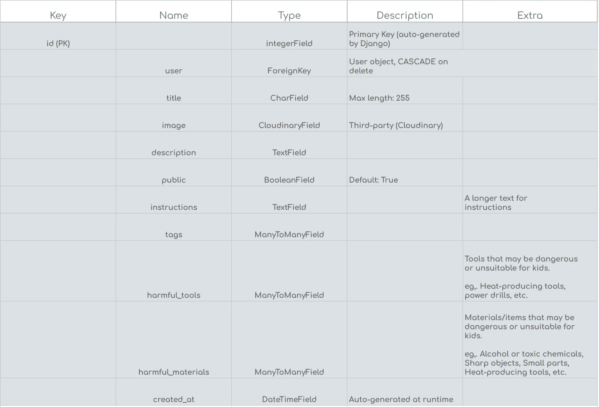

# Reoptinew API

**Navigate to the deployed API** [here](https://reoptinew-api-c16dc2520739.herokuapp.com/) 🔥

## Table of Contents

- 🗺️ [Project Map](#map)
- 🎨 [Frontend](#frontend)
- 🛢️ [Databases](#databases)
- ❌ [Error handling](#error-handling)
- 🛠️ [Technologies](#technologies)
- 🧬🍴 [Cloning and Forking the Repository](#cloning-and-forking-the-repository)
- 🏃‍♂️ [Run the App](#run-the-app)
- ☁️ [Deployment, CI/CD Pipeline, and Automatic Testing](#deployment-cicd-pipeline-and-automatic-testing)
- ✨ [Credits](#credits)
- 🖊️ [References](#references)

## Project Map 

The "map" below provides an overview of key resources in this project. 

#### External resources

- 🖥️ [Live web app](https://reoptinew-09d333f23d8e.herokuapp.com/)  
- 🎨 [Frontend repository (with documentation)](https://github.com/KevinBjarnemark/reoptinew). 

#### Documentation

- 📉 [First iteration](https://github.com/KevinBjarnemark/reoptinew/blob/main/docs/iteration-1/README.md)  
- 📉 [Sprints](https://github.com/KevinBjarnemark/reoptinew/tree/main/docs/iteration-1/sprints)  
- 📃 [GitHub Projects (Kanban)](https://github.com/users/KevinBjarnemark/projects/10).

## Frontend

The Reoptinew web app uses a decoupled architecture, separating the frontend and backend repositories. The **frontend repository** can be found [**here**](https://github.com/KevinBjarnemark/reoptinew).

## Databases

Currently, there are three separate databases that Reoptinew relies on. One for testing, another for development, and another for production. 

- **Testing database**

    - Designed to be a "clean sheet" for running automated tests. It provides a temporary environment where all data exists in memory and is completely erased after the tests finish. This ensures no impact on development or production data during the testing process.

- **Development Database**

    - Intended for local development and debugging. It contains data specific to the development process and is configured to be easily replaceable if needed.

- **Production Database**

    - Stores real user data and operates in a secure, live environment.

### Models

You can find the complete data schema for all models in this [Google Drive folder](https://drive.google.com/drive/folders/1WrPCJ0CRQjOo84iZWGu7mcBEgYjKUaZA?usp=sharing). 




## Error Handling

Reoptinew’s error-handling system is built on three core principles: 

- **User experience**
- **Security** 
- **Troubleshooting**

### User Experience

The backend ensures that all errors sent to the frontend are clear, user-friendly, and meaningful. Error messages are mapped to custom messages that align with Reoptinew’s branding and interface standards. 

For additional UX details, visit the [**frontend repository**](https://github.com/KevinBjarnemark/reoptinew).

### Security

Reoptinew prioritizes security by implementing a **controlled error system** to eliminate risks associated with exposing raw backend data. 

Key benefits of this system include:

1. **Thorough Validation:**   
    Every piece of information sent to the client is inspected and sanitized.

2. **Backend Logic Protection:**  
    While Reoptinew's backend logic is open-source and fully transparent, the system ensures that runtime details, such as stack traces or low-level error messages, are not exposed to the frontend.

3. **Resilience Against Updates:**  
    Controlled error handling mitigates risks of application failures caused by changes in dependencies or library updates.

### Troubleshooting, Performance, and Logging

Printing to the console with `print()` in production is discouraged due to potential security and performance risks. Reoptinew instead relies on a custom logging system [loggin.py](static/utils/logging.py) to ensure clarity, consistency, and controlled output.

- **Detailed Logs:**  
The [throw_error()](static/utils/error_handling.py) function captures all errors with contextual metadata, such as the file and function where the error occurred.

## Technologies

See [requirements.txt](requirements.txt) for the full third party packages list.


### Programming languages

<details>
    <summary>
        Python
    </summary>

**A popular language famous for its readability and efficiency in back-end development.** 

</details>

### Frameworks

<details>
    <summary>
        Django
    </summary>

**A web framework that simplifies the creation of secure and scalable web applications.**

</details>

<details>
    <summary>
        Django REST Framework (DRF):
    </summary>

**An extension of Django for building feature-rich, RESTful APIs.**

</details>

### Authentication

<details>
    <summary>
        PyJWT
    </summary>

**A Python library for JSON Web Tokens (JWT).**

PyJWT is a library for encoding and decoding JSON Web Tokens. It supports token signing and validation using various algorithms.

</details>

### Cloud services

<details>
    <summary>
        Cloudinary
    </summary>

**A cloud-based service for managing, storing, and delivering media assets like images and videos.**

</details>

### Testing

<details>
    <summary>
        Pytest
    </summary>

**A testing framework for Python applications.**

Pytest is a framework used for writing and running tests in Python. It supports features like fixtures, parameterized tests.

</details>

### Environment Management

<details>
    <summary>
        python-decouple
    </summary>

**A lightweight library for separating configuration settings from source code, improving maintainability and security.**

</details>

### Additional libraries

<details>
    <summary>
        dj-database-url
    </summary>

**A utility to configure database connections using a single database URL, simplifying the transition between development, testing, and production environments.**

</details>

<details>
    <summary>
        psycopg2-binary
    </summary>

**A PostgreSQL adapter for Python, enabling seamless integration with PostgreSQL databases.**

</details>

<details>
    <summary>
        pillow
    </summary>

**A library for image processing in Python, supporting tasks like image resizing, format conversion, and filtering.**

</details>

<details>
    <summary>
        django-cors-headers
    </summary>

**A middleware for handling Cross-Origin Resource Sharing (CORS) in Django, ensuring secure communication between the front-end and back-end.**

</details>

<details>
    <summary>
        django-cloudinary-storage
    </summary>

**A package for integrating Cloudinary with Django, providing a way to manage media files in the cloud.**

</details>

## Cloning and Forking the Repository

To avoid repeating ourselves too much we've used the frontend repository as a base for certain information. The cloning and forking have been explained in the [frontend repository's documentation](https://github.com/KevinBjarnemark/reoptinew) and the process should be the same for this repository.

**Note** that Python doesn't create an environment by default, like node does by generating a `node_modules` folder. If you want to containerize this API locally and also ensure it's functionality remains functional over time, follow the steps below.

> ❕ **Info**  
> There are other ways of creating a virtual environment and the below example is just one way of doing it.

- Open your terminal
- Go to your project folder
    > ⚠️ **NOTE**  
    > We'll create the virtual environment one level above the project folder
    ```bash
    cd "path/to/your/project_folder"
    ```
- Create the environment 
    ```bash
    python -m venv venv
    ```
- Activate the environment
    ```bash
    .\venv\scripts\activate
    ```
- Install dependencies
    ```bash
    python -m pip install --upgrade setuptools
    python -m pip install --upgrade pip
    pip install -r requirements.txt
    ```
- Enter the project
    ```bash
    cd reoptinew-api
    ```

## Run the app

After [cloning or forking the repository](#cloning-and-forking-the-repository) on your side, you're almost there. Follow the steps below.

- Configure environment variables
    - The [.env.example](.env.example) file serves as your guide for configuring environment variables. 

After configuring the environment variables, you should be able to run the app with the following command.

> ⚠️ **NOTE**  
> Again, to use a specific IP Address like this is a security feature. Never expose this address in the repository. 

> ❕ **Info**  
> If you don't know your IP Adress you can find it by simply running `ipconfig` in your terminal. Look for the `IPv4 Address`.

```bash
py manage.py runserver <your-ip-address>:8000
```

## Deployment, CI/CD Pipeline, and Automatic Testing

Reoptinew's deployment process is almost exactly the same for the frontend as with the backend. Since this process is already explained in full detail, we advise you to reference the [frontend repository's documentation](https://github.com/KevinBjarnemark/reoptinew). This includes guides how to set everything up including automatic testing both locally and within the GitHub Actions environment.

If you're new to `Heroku`, `deployment`, `CI/CD pipelines`, and `automatic testing`, we suggest you **start by configuring the frontend repository**. This should familiarize you with this the processes involved. When you feel comfortable deploying the frontend, there are only a few differences to be aware of when deploying the API.

#### Key Differences

The `heruko/python` buildpack, a slightly altered [deploy.yml](.github/workflows/deploy.yml) file tailored to `Python` and some environment variables that needs to be configured. That's about it!

##### heruko/python buildpack

In the frontend we added the `heroku/node.js` buildpack, this is not needed in the API because node is not used. Instead add the `heruko/python` buildpack.

###### CI/CD Pipeline and Automatic Testing

In the [deploy.yml](.github/workflows/deploy.yml) file, there are some differences compared with the frontend repository. While the Heroku deployment is the same, there are some environment differences. 

For starters, instead of testing with `Jest`, we use `pytest`, example below. 

```yml
- name: Run Django tests
run: pytest
env:
    DJANGO_SETTINGS_MODULE: config.settings
    # Override DATABASE_URL during tests
    DATABASE_URL: "sqlite:///:memory:" 
    DEV_SERVER_HOST: ${{ secrets.DEV_SERVER_HOST }}
    DEV_SERVER_PORT: ${{ secrets.DEV_SERVER_PORT }}
    DEV_SERVER_FRONTEND_PORT: ${{ secrets.DEV_SERVER_FRONTEND_PORT }}
```

If you want to also configure a `Git Hook` to test locally before pushing, you can use a similar pre-push hook, like the one below. Again since we're not using `Node` or `Jest`, the pre-push hook should call `pytest` instead. 

```bash
#!/bin/bash
echo "Running tests before pushing..."

# Activate virtual environment for Python
source venv\Scripts\activate

# Run pytest for Django tests
pytest
PYTHON_STATUS=$?

# Check if any tests failed
if [ $PYTHON_STATUS -ne 0 ]; then
    echo "Tests failed. Push aborted."
    exit 1
else
    echo "All tests passed! Proceeding with push."
    exit 0
fi
```

## Credits

    As the only developer working on this project, I will reference myself in 
    first-person and point you to some people, tools, and sources that 
    helped me along the way.

### Custom error messages

I've never worked with Django REST Framework (DRF) before, and unexpected challenges appeared when I was trying to customize error messages. My goal was to fully customize all error messages, simplifying complex errors with generic messages. But, I never figured out how to achieve that without allowing unchecked messages to slip through. This was mainly due to the fact that an error thrown in the model (before reaching the validate method) breaks code execution and stop further validation. 

However, [mariodev](https://stackoverflow.com/users/1566605/mariodev) in [this thread](https://stackoverflow.com/questions/26943985/custom-error-messages-in-django-rest-framework-serializer) had a perfect solution for customizing specified error message before reaching the validate() method.

Here's how I used his solution in [serializers.py](apps/users/serializers.py)
```python
# Overwrite default error messages with custom errors
def __init__(self, *args, **kwargs):
    super(SignUpSerializer, self).__init__(*args, **kwargs)
    self.fields['username'].error_messages['required'] = 'You must enter a username.'
    self.fields['username'].error_messages['blank'] = 'Username is missing.'
```

## Extensions

<details>
    <summary>
        Pylint
    </summary>

**Python Linter**

Pylint is a code analysis tool for Python that checks your code for errors, enforces coding standards, and offers suggestions to improve code quality. It supports customizable rules and integrates with most editors, helping maintain clean and maintainable Python code.

**Tip:** You don't need the Pylint package when using the extension (unless you want to include it in a CI/CD pipeline or similar). If you just want a configuration file, you can install Pylint temporarily and generate it with the command below.

```
pylint --generate-rcfile > .pylintrc
```

</details>

<details>
    <summary>
        Black
    </summary>

**Code formatting tool**

Black is a code formatting tool for Python that enforces a consistent style by reformatting your code. It prioritizes readability and avoids manual formatting by following strict and consistent rules. Specifically, I've been using the [VS Code extension](https://marketplace.visualstudio.com/items?itemName=ms-python.black-formatter). [Here's](pyproject.toml) the configuration file.

</details>

## References

It's worth mentioning **source code references**. These references can be found in the project itself, particularly in the `venv` folder (if you're using a virtual environment). 

- For example, during the implementation of the error handling system, classes from `Lib/site-packages/rest_framework/fields.py` helped with gaining a deeper understanding of the underlying processes within the Django Rest Framework.

- [Django REST Framework docs](https://www.django-rest-framework.org/)
- [Django REST Framework (GitHub docs)](https://github.com/encode/django-rest-framework/tree/master/docs/api-guide)
- [JWT](https://django-rest-framework-simplejwt.readthedocs.io/en/latest/getting_started.html)
